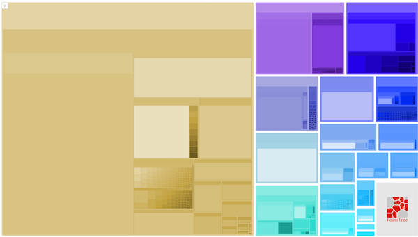

# BootstrapVue Loader
A Webpack plugin for automatic BootstrapVue components and directives importing, mainly for treeshaking. Reduce the bundle size and achieve even distribution of chunks size, without the need for manual importing each used component.

Example of chunks distribution between build with global BoostrapVue import and build with the plugin: 

 


## How to use it

`npm install -D bootstrap-vue-loader`

`yarn add -D bootstrap-vue-loader`

### vue-cli

vue.config.js
```javascript
const BootstrapVueLoader = require('bootstrap-vue-loader')
module.exports = {
    configureWebpack: {
        plugins: [ new BootstrapVueLoader() ]
    }
}
```

Remember to **REMOVE** global BootstrapVue import!
```javascript
// import BootstrapVue from 'bootstrap-vue'
// Vue.use(BootstrapVue)
```

### nuxt.js
nuxt.config.js
```javascript
import BootstrapVueLoader from 'bootstrap-vue-loader'

export default {
    css: [
        'bootstrap/dist/css/bootstrap.min.css',
        'bootstrap-vue/dist/bootstrap-vue.css'
      ],
    build: {
        plugins: [
          new BootstrapVueLoader()
        ]
      }
}
```
With above config there is no need for global BootstrapVue module.
Remove it if you already have it configured: 
```
modules: [
    // 'bootstrap-vue/nuxt',
  ],
```


## When use it? 

* If you use only some of the available BoostrapVue components and don't want to take care of manual importing but still you want to minimize the bundle size (smaller bundle == faster page). 
* If you have a big project with a lot of pages, and you want to achieve a better distribution of chunks size (no one wants to ship to the user components that are not used on the current page)

## Current limitation: 
If you are using the global bvModal / bvToast plugin you need to import them manually

### vue-cli
main.js
```javascript
import { ModalPlugin } from 'bootstrap-vue'
Vue.use(ModalPlugin)
```

### nuxt.js
nuxt.config.js
```javascript
import BootstrapVueLoader from 'bootstrap-vue-loader'

 export default {
    modules: [
        'bootstrap-vue/nuxt',
    ],
    bootstrapVue: {
        componentPlugins: ['BVModalPlugin'],
    },
    build: {
        plugins: [
            new BootstrapVueLoader()
        ]
    }
}
```

## Want to play with it?
Just go to `/dev` directory, install dependencies (`yarn`) and run `yarn serve`. 
BootstrapVue components are rendered, but there is no import anywhere.

## Testing strategy
To be sure that this plugin is working well with every component and directive available in BootstrapVue I've implemented a quite interesting approach. The test components are generated automatically from the library documentation and then tested by cypress scenarios. Thanks to that there is no need to manually write a new test for each component delivered in future versions of BootstrapVue. Just upgrade a version in the project and re-run the test pipeline! 

## Credits
This is kind of [vuetify-loader](https://github.com/vuetifyjs/vuetify-loader) fork, and I would like to thank that team for hard work and inspiration. 

